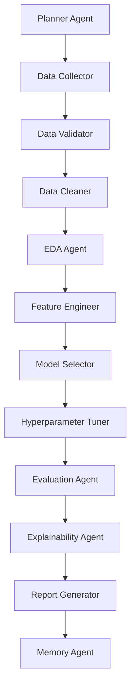

# ModelSmith AI – Autonomous Research Platform

ModelSmith AI is an autonomous, multi-agent AI research platform designed to automate the end-to-end machine learning lifecycle for tabular datasets. From a simple natural language prompt, the system orchestrates a team of specialized AI agents to validate data, engineer features, train and tune candidate models, extract model explainability details, and compile professional research reports.


## Key Features

- **Autonomous Agent Orchestration**: Features a coordinator that manages a sequential pipeline of 12 specialized agents.
- **Natural Language Planning**: Uses Gemini models to translate abstract machine learning goals into concrete execution steps.
- **Dynamic Synthetic Generator**: Automatically compiles rich, domain-specific synthetic datasets (e.g., house prices, diabetes risk, customer churn) if no dataset is uploaded.
- **Real-Time Telemetry Dashboard**: A stunning, modern dashboard showing agent logs, model leaderboards, and evaluation plots in real time.
- **Long-Term Memory Integration**: Uses database memory stores to retrieve contexts from previous experiments, improving iteration speed and pipeline relevance.
- **Automatic Research Reports**: Generates professional HTML & Markdown summaries including canditate leaderboards, diagnostic assessments, and explainability findings.

---

## Agent Pipeline Flow & Architecture

The research lifecycle is divided among the following specialized agents:



1. **Planner Agent**: Analyzes the problem statement and designs the target category, model candidates, and validation requirements.
2. **Data Collector**: Copies uploaded CSV data or generates a domain-appropriate synthetic dataset.
3. **Data Validator**: Audits dataset quality, recording duplicates, missing value percentages, and computing a general quality score.
4. **Data Cleaner**: Normalizes column headers, drops duplicates, and applies median/mode missing value imputations.
5. **EDA Agent**: Performs correlation analysis and plots the target distribution.
6. **Feature Engineer**: Performs standard scaling, category label encoding, and extracts lag/calendar features for forecasting tasks.
7. **Model Selector**: Trains candidate models (linear models, decision trees, ensembles) and ranks them in a leaderboard.
8. **Hyperparameter Tuner**: Optimizes the best model using GridSearchCV and evaluates performance improvement.
9. **Evaluation Agent**: Analyzes the final model, compiles diagnostic reports (overfitting/underfitting checks), and plots confusion matrices/residuals.
10. **Explainability Agent**: Extracts feature weights/importances and formulates natural language explanations.
11. **Report Generator**: Combines all agent metrics and plots into a formatted HTML and Markdown report.
12. **Memory Agent**: Records the run's metadata into long-term SQL memory to allow iterative refinements.

---

## Screenshots

### Research Operations Dashboard
Manage projects, configure settings, and view recent runs on a unified glassmorphic console.


### Model Evaluation & Candidate Visualizations
Inspect data attributes and candidate models using generated interactive charts.

| Correlation Heatmap | Target Distribution |
|---|---|
|  |  |

| Predictive Feature Importance | Validation Residual Plots |
|---|---|
|  |  |

### System Settings Configuration
Connect the platform to Gemini models by inputting Developer API keys and selecting default LLMs.


---

## Getting Started

### Prerequisites
- Python 3.10+

### Installation & Setup

1. **Clone the Repository**:
   ```bash
   git clone https://github.com/Tarak098/modelsmith-ai.git
   cd modelsmith-ai
   ```

2. **Initialize Environment**:
   Ensure dependencies are installed in your virtual environment:
   ```bash
   source venv/bin/activate
   pip install -r auto_ai/requirements.txt
   ```

3. **Run the Application Server**:
   Start the FastAPI app locally:
   ```bash
   PYTHONPATH=. python auto_ai/app/main.py
   ```
   Open your browser and navigate to `http://localhost:8000` to access the console.
