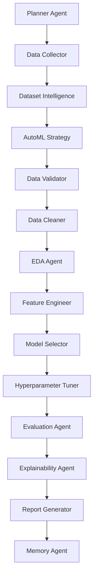
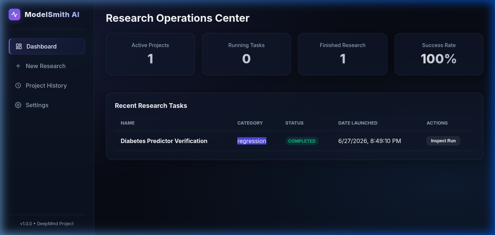
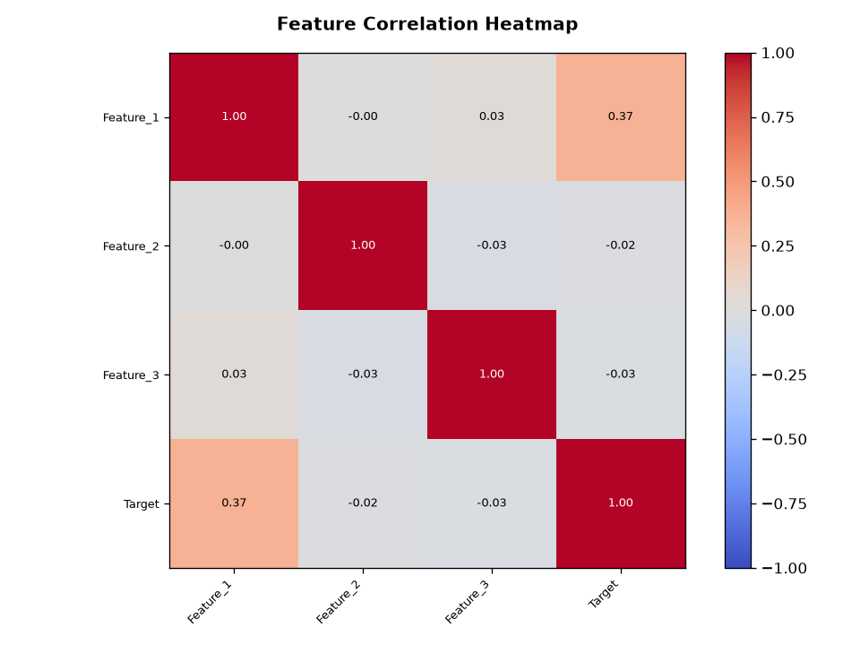
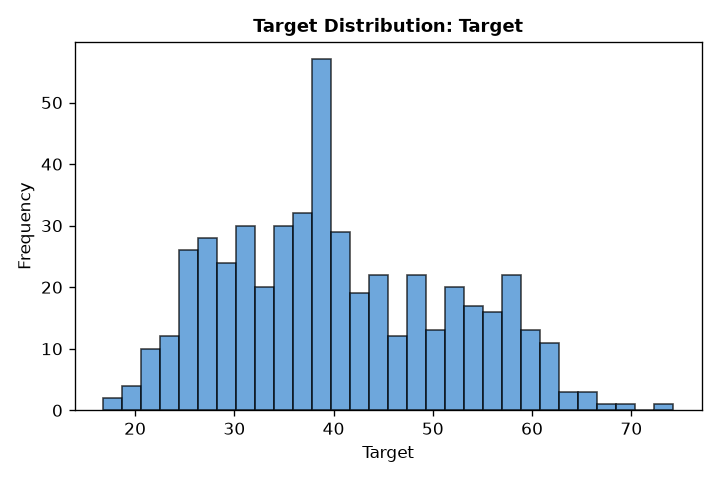
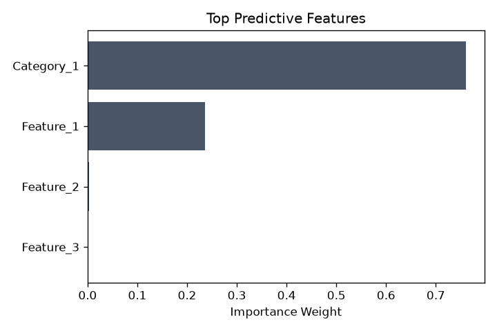
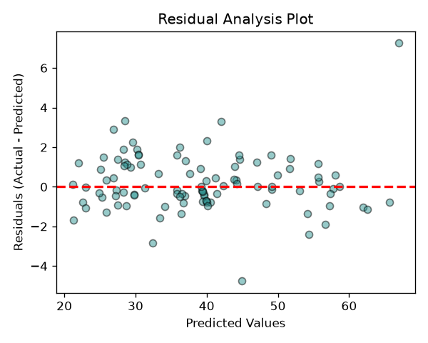
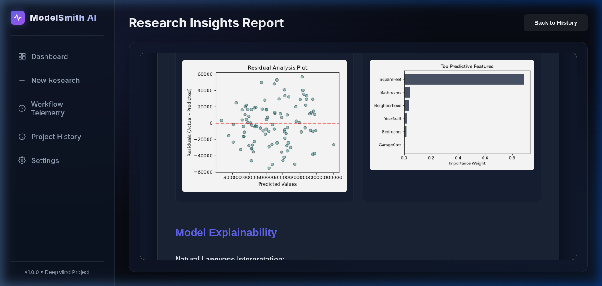
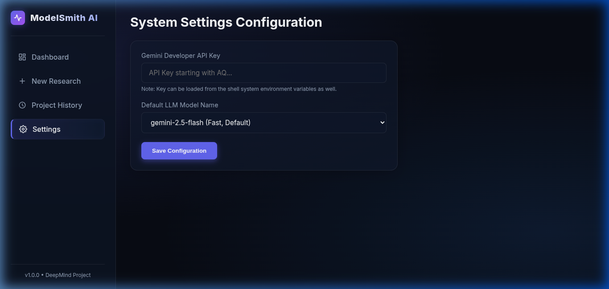
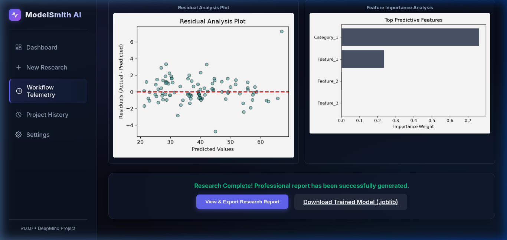
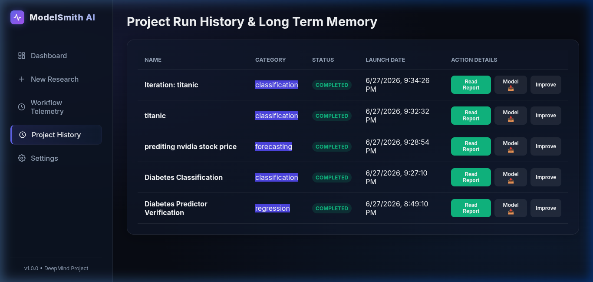

# ModelSmith AI – Autonomous Research Platform

ModelSmith AI is an autonomous, multi-agent AI research platform designed to automate the end-to-end machine learning lifecycle for tabular datasets. From a simple natural language prompt, the system orchestrates a team of specialized AI agents to retrieve datasets, scan profiles, formulate adaptive configurations, validate data, engineer features, train and tune candidate models, extract model explainability details, and compile professional research reports.


## Key Features

- **Sequential Dataset Search & Retrieval**: Sequentially searches Cache, OpenML, Kaggle, UCI, and Scikit-Learn repositories before falling back to synthetic generator datasets.
- **Dataset Intelligence & Profile Scanner**: Computes MD5 file hashes, missing cell and IQR outlier rates, scans for data leakage, and matches targets.
- **Feedback-Driven Task Mismatches**: Pauses execution and transitions to `awaiting_feedback` status when dataset target variables conflict with user classification/regression categories.
- **AutoML Strategy Agent**: Formulates scaling methods (Standard/Robust), categorical encoders (OneHot/Target), model pools, and search limits.
- **5-Step Retry Optimization Loop**: Sequentially retries model benchmark runs (Default $\rightarrow$ RobustScaler $\rightarrow$ Log transforms $\rightarrow$ Feature drops $\rightarrow$ SVM/MLP) if validation scores fall below target thresholds.
- **Dynamic Tuning Budgets**: RandomizedSearchCV tuning limits scale according to row dimensions (skips for >100k rows, lightweight for 20k-100k, full for <20k).
- **Stunning Real-Time Telemetry Dashboard**: A glassmorphic console displaying detailed CV score leaderboards, time budgets, and training speeds.
- **Long-Term Memory store**: Caches models, parameters, and transformations using MD5 dataset hashes to skip training on identical data run requests.

---

## Agent Pipeline Flow & Architecture

The research lifecycle is divided among the following specialized agents:



1. **Planner Agent**: Translates abstract goals into category definitions and model validation specifications.
2. **Data Collector**: Sequentially searches local caches and remote repositories, falling back to LLM-guided synthetic generators.
3. **Dataset Intelligence**: Scans data characteristics, flags leakages, and validates prompt categories.
4. **AutoML Strategy**: Dynamically decides optimal preprocess steps, cross-validation folds, and training times.
5. **Data Validator**: Evaluates row duplicates, missing rates, and quality scores.
6. **Data Cleaner**: Drops duplicates and imputes values using strategy-specified configurations.
7. **EDA Agent**: Renders correlation heatmaps and target distributions.
8. **Feature Engineer**: Implements standard scaling, categorical encoding, datetime extractions, and forecasting lags.
9. **Model Selector**: Executes the 5-attempt retry loop on benchmarks to find the best model.
10. **Hyperparameter Tuner**: Runs RandomizedSearchCV with size-adaptive budgets.
11. **Evaluation Agent**: Compiles validation metrics, residual plots, and overfitting diagnostics.
12. **Explainability Agent**: Extracts tree-based or coefficient importances, and logs architect reasoning details.
13. **Report Generator**: Generates clean HTML & Markdown research summaries.
14. **Memory Agent**: Indexes final context caches under dataset MD5 hashes.

---

## Screenshots

### Research Operations Dashboard
Manage projects, configure settings, and view recent runs on a unified glassmorphic console.



### Model Evaluation & Candidate Visualizations
Inspect data attributes and candidate models using generated interactive charts.

| Correlation Heatmap | Target Distribution |
|---|---|
|  |  |

| Predictive Feature Importance | Validation Residual Plots |
|---|---|
|  |  |

### Dynamic Multi-Category Research Reports
The system dynamically adapts to **Classification**, **Regression**, and **Time Series Forecasting** tasks, generating customized synthetic datasets, feature engineering steps, evaluation metrics (Accuracy/F1 vs. R2/MAE/RMSE), and plots.



### System Settings Configuration
Connect the platform to Gemini models by inputting Developer API keys and selecting default LLMs.



### Model Exporting
After training completes, download the final serialized ML model file directly from the dashboard:

| Telemetry Completion Card | Project History Download |
|---|---|
|  |  |

---

## Getting Started

### Prerequisites
- Python 3.10+

### Installation & Setup

1. **Clone the Repository**:
   ```bash
   git clone https://github.com/Tarak098/modelsmith-ai.git
   cd modelsmith-ai
   ```

2. **Initialize Environment**:
   Ensure dependencies are installed in your virtual environment:
   ```bash
   source venv/bin/activate
   pip install -r auto_ai/requirements.txt
   ```

3. **Run the Application Server**:
   Start the FastAPI app locally:
   ```bash
   PYTHONPATH=. python auto_ai/app/main.py
   ```
   Open your browser and navigate to `http://localhost:8000` to access the console.
